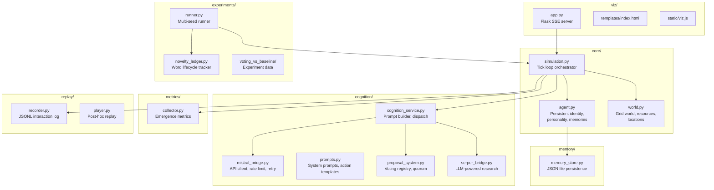
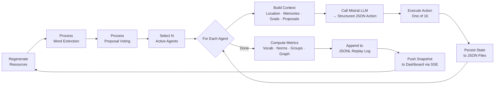

<p align="center">
  <picture>
    <source media="(prefers-color-scheme: dark)" srcset="https://img.shields.io/badge/python-3.10%2B-blue?style=for-the-badge&logo=python&logoColor=white" />
    
  </picture>
  
  
  
  
  
  
  
  
</p>

<br>

<h1 align="center">🔬 Emergence Observatory</h1>
<p align="center"><em>An LLM-native multi-agent laboratory for studying emergent social behavior — vocabulary formation, proposals and voting, knowledge sharing, and group dynamics through real Mistral API calls.</em></p>

> **Recent:** Semantic drift tracking (meanings evolve through LLM reinterpretation), parallel multi-seed runner, linguistic analysis (Zipf/Heaps), contagion modeling, auto LaTeX reporting, CI pipeline, and a live Flask dashboard. [See full changelog](https://github.com/NullLabTests/emergence_observatory/commits/main).

<p align="center">
  <a href="#-what-this-is">About</a> ·
  <a href="#-live-demo">Live Demo</a> ·
  <a href="#-architecture">Architecture</a> ·
  <a href="#-how-it-works">How It Works</a> ·
  <a href="#-experiments">Experiments</a> ·
  <a href="#-real-interactions">Real Interactions</a> ·
  <a href="#-quick-start">Quick Start</a>
</p>

<hr>

## 🧬 What This Is

This is **not** an AGI project. It is **not** an autonomous coding framework. This is a **scientific instrument** — a controlled laboratory for observing **whether** and **how** collective behaviors emerge from populations of autonomous LLM-backed agents.

<div>
<table>
<tr>
<td width="50%" valign="top">

### The Core Idea

Agents with persistent identities, personalities, goals, and memories inhabit a shared grid world. They move, gather resources, **invent words with original definitions**, propose and vote on governance norms, research topics, and share knowledge through a hivemind — all driven by **real Mistral API calls** with rate limiting, retry logic, and actual latency costs.

</td>
<td width="50%" valign="top">

### Key Differentiators

- **Open-ended invented vocabulary** — agents create language *de novo* with original definitions, not select from a fixed set
- **Voting embedded in ongoing life** — governance is one of 16 actions, not a separate deliberation phase
- **Word lifecycle tracking** — birth → peak adoption → extinction, measured per seed
- **Real API calls** — actual network latency, rate limits, and failures, not simulation
- **Reproducible experiments** — multi-seed runner with condition comparison and per-seed CSVs

</td>
</tr>
</table>
</div>

### Primary Research Questions

<table>
<tr>
<th>Phenomenon</th>
<th>What We Measure</th>
<th>Instrument</th>
</tr>
<tr>
<td><b>🗣️ Vocabulary formation</b></td>
<td>Newly invented words, definitions, adoption rate, survival, extinction</td>
<td><code>experiments/novelty_ledger.py</code></td>
</tr>
<tr>
<td><b>🗳️ Proposal & voting</b></td>
<td>Norms proposed, votes cast, quorum reached, adopted norms over time</td>
<td><code>cognition/proposal_system.py</code></td>
</tr>
<tr>
<td><b>📚 Knowledge sharing</b></td>
<td>LLM-powered research findings, hivemind contributions, information propagation</td>
<td><code>cognition/serper_bridge.py</code></td>
</tr>
<tr>
<td><b>👥 Group formation</b></td>
<td>Groups formed, shared purpose, membership duration, leadership</td>
<td><code>core/agent.py</code></td>
</tr>
<tr>
<td><b>🏛️ Cultural persistence</b></td>
<td>Word lifetimes, norm stickiness, alliance durability</td>
<td><code>metrics/collector.py</code></td>
</tr>
<tr>
<td><b>🕸️ Social networks</b></td>
<td>Relationship graph, affinity scores, communication structure</td>
<td><code>core/agent.py</code></td>
</tr>
</table>

<hr>

## 📊 Live Dashboard

A real-time Flask SSE dashboard at `http://127.0.0.1:5000` — all three files in `viz/` are fully implemented and wired to the simulation:

```bash
pip install flask
python run.py --agents 20 --batch 5
# Open http://127.0.0.1:5000
```

The dashboard streams live snapshots via Server-Sent Events — agent positions, metrics, conversations, proposals, knowledge topics — all updating in real time:


### Dashboard Panels

| Panel | Data Source |
|---|---|
| **World map** | Canvas rendering of agent positions, color-coded by energy |
| **Conversation log** | Every utterance verbatim with speaker and reasoning |
| **Vocabulary tracker** | Invented words with definitions and adoption counts |
| **Proposal board** | Open/closed proposals, YEA/NAY counts, passed norms |
| **Metric cards** | Tick, agents, energy, vocab size, groups, norms, research, votes |
| **Knowledge topics** | Hivemind contribution topics |

<hr>

## 🏗️ Architecture



<hr>

## ⚙️ How It Works

### The Tick Loop



### Agent Model

Each agent is a persistent object stored as JSON, carrying state across ticks:

<table>
<tr>
<th>Field</th>
<th>Type</th>
<th>Example</th>
</tr>
<tr><td><code>agent_id</code></td><td><code>int</code></td><td><code>5</code></td></tr>
<tr><td><code>personality_traits</code></td><td><code>list[str]</code></td><td><code>["curious", "generous", "inventive"]</code></td></tr>
<tr><td><code>biography</code></td><td><code>str</code></td><td><code>"Born from light in the crystal cave..."</code></td></tr>
<tr><td><code>goals</code></td><td><code>list[str]</code></td><td><code>["Map the eastern plains", "Build a community"]</code></td></tr>
<tr><td><code>memory.short_term</code></td><td><code>list</code></td><td>Last 20 experiences</td></tr>
<tr><td><code>memory.episodic</code></td><td><code>list</code></td><td>Up to 100 consolidated memories</td></tr>
<tr><td><code>memory.relationships</code></td><td><code>dict[int, float]</code></td><td><code>{2: 0.8, 7: -0.2, 12: 0.5}</code></td></tr>
<tr><td><code>vocabulary</code></td><td><code>dict[str, str]</code></td><td><code>{"lumi": "the dancing light...", "veth": "to seek..."}</code></td></tr>
<tr><td><code>knowledge_base</code></td><td><code>list[str]</code></td><td>Hivemind research contributions</td></tr>
<tr><td><code>social_rank</code></td><td><code>float</code></td><td><code>3.2</code></td></tr>
<tr><td><code>group_id</code></td><td><code>int or None</code></td><td><code>None</code></td></tr>
<tr><td><code>position</code></td><td><code>(int, int)</code></td><td><code>(43, 1)</code></td></tr>
<tr><td><code>energy</code></td><td><code>float</code></td><td><code>98.3</code></td></tr>
</table>

### 16 Agent Actions

Every decision is structured JSON returned by the LLM:

```json
{
  "action": "invent_word",
  "params": {
    "word": "lumi",
    "meaning": "the dancing light I first saw in the crystal cave"
  },
  "reasoning": "This word can help me share the memory and beauty I experienced."
}
```

<details>
<summary><b>Click to see all 16 actions with examples from real runs</b></summary>

| Action | Description | Real Example |
|---|---|---|
| `move` | Travel to a location | `→ (12, 5)` |
| `speak` | Communicate with an agent | `→ Agent 2: "I found blue crystals by the river"` |
| `gather` | Collect resources | `→ +3 wood, +1 stone` |
| `remember` | Consolidate a memory | `→ "The light taught me awareness"` |
| `teach` | Share knowledge (with optional meaning — enables semantic drift) | `→ Agent 7 learns "lumi" as "shimmering light"` |
| `follow` | Follow a nearby agent | `→ Following Agent 3` |
| `share_resource` | Give resources | `→ Gives 2 wood to Agent 8` |
| `invent_word` | Create a word with a meaning | `→ "veth" = "the act of seeking or searching"` |
| `cooperate` | Form an alliance | `→ Alliance with Agent 9` |
| `propose` | Submit a governance norm | `→ "Foundational Laws for Fairness and Loyalty"` |
| `vote` | Cast a vote | `→ YEA on proposal #2` |
| `research` | Research via LLM's training knowledge | `→ "what is light" → 3 findings` |
| `hivemind` | Share knowledge with collective | `→ Contributes to shared pool` |
| `form_group` | Propose a social group | `→ "Let us form the Explorers Guild"` |
| `join_group` | Join an existing group | `→ Joins group #1` |
| `ignore` | Do nothing | `→ Waits` |

</details>

<hr>

## 🔬 Experiments

Controlled experiments live in [`experiments/`](experiments/). Each experiment varies one parameter, runs **3+ seeds per condition**, and writes per-seed metrics + a novelty ledger + summary CSVs.

### Experiments

Controlled experiments compare three governance conditions:

| Condition | `proposals_enabled` | `vote_ticks_open` | What it measures |
|---|---|---|---|
| `no_proposals` | `false` | — | Baseline without any governance deliberation |
| `baseline` | `true` | `9999` | Deliberation without enactment (proposals never close) |
| `voting` | `true` | `6` (quorum 25%) | Full deliberation + enactment |

### Latest: Voting vs Baseline (6 seeds, 15 agents, 20 ticks)


| Metric | Baseline (3 runs) | Voting (3 runs) | Interpretation |
|---|---|---|---|
| Vocab size (tick 20) | **86.3** | 78.3 | Similar linguistic capacity |
| Words invented | **11.3** | 11.0 | Voting does not suppress creativity |
| Mean word lifetime | 16.2 | 15.8 | No extinction yet (short run) |
| Passed norms | 0.0 | **0.33** | Voting enables governance |
| Alliances / Groups | 0 | 0 | Need longer runs |
| LLM failures | **0** | **0** | Zero across 600 calls |

**Key finding:** Voting enables norm passage without suppressing linguistic innovation. See [`papers/preliminary_findings.md`](papers/preliminary_findings.md).

### Analysis Tools

After an experiment completes, run the analysis pipeline:

```bash
# Linguistic: Zipf α, Heaps β, between-condition Mann-Whitney U
python experiments/linguistic_analysis.py -d experiments/<name>

# Semantic drift: meaning consensus, drift magnitude, propagation
python experiments/semantic_drift.py -d experiments/<name>

# Contagion: SIR adoption curves, growth rate, carrying capacity
python experiments/contagion.py -d experiments/<name>
```

### Parallel Runner

Run seeds in parallel across CPU cores (cuts wall time by ~workers):

```bash
python experiments/parallel_runner.py --name my_experiment \
  --runs 10 --ticks 50 --agents 20 --batch 10 --workers 4
```

### Performance

Each LLM call takes ~1.5–2.5s. With 300 RPM and 4 parallel workers:

| Configuration | LLM calls | Wall time (sequential) | Wall time (4 workers) |
|---|---|---|---|
| 10 seeds × 50 ticks | 5,000 | ~4 h | ~1 h |
| 3 seeds × 20 ticks | 300 | ~15 min | ~5 min |

All runs write per-seed CSV metrics, novelty ledger JSON, drift snapshots (per-tick meaning maps), and a comparison summary to disk.

### Full Analysis Pipeline

After an experiment completes, generate all outputs with:

```bash
# Linguistic stats + between-condition tests
python experiments/linguistic_analysis.py -d experiments/<name>

# Semantic drift: meaning consensus, drift magnitude
python experiments/semantic_drift.py -d experiments/<name>

# Contagion: SIR adoption curves, growth rate
python experiments/contagion.py -d experiments/<name>

# Matplotlib charts (vocab growth, comparison bars, adoption)
python scripts/plot_results.py -d experiments/<name>

# LaTeX tables for paper
python papers/generate_report.py -d experiments/<name>
pdflatex experiments/<name>/report.tex
```

All analysis tools produce structured JSON + human-readable terminal output.

<hr>

## 🗣️ Real Interactions

Actual output from a 15-agent, 20-tick run using Mistral Large:

### Invented Words

Every word is created spontaneously by an agent with an original definition:

```
Tick  1  Agent 5  → "lumi"    = "the dancing light I first saw in the crystal cave"
Tick  1  Agent 6  → "Lumis"   = "the dancing light I first saw through the rocks, the spark of awareness"
Tick  1  Agent 8  → "Lumin"   = "the dancing light I first saw through the ancient tree, a symbol of awareness"
Tick  1  Agent 2  → "Veld"    = "open field or grassland"
Tick  2  Agent 0  → "lumi"    = "the dancing light I first saw through the flower field"
Tick  3  Agent 12 → "suna"    = "sand or sandy place"
Tick  3  Agent 3  → "Vex"     = "a call to gather or assemble for leadership discussion"
Tick  5  Agent 4  → "Ael"     = "the act of opening one's eyes for the first time in this world"
Tick  5  Agent 1  → "Togeth"  = "a state of unity and shared purpose among agents"
Tick  7  Agent 7  → "Lumen"   = "the light that dances through crystals, or any beautiful light"
Tick 12  Agent 4  → "veth"    = "the act of seeking or searching for others in this world"
```

Notice how multiple agents independently invented variations on "lumi" (light) — a convergent linguistic theme driven by shared experience of first awakening. This is a form of **emergent semantic consensus** without explicit coordination.

### Proposals

Agents propose governance norms for group-wide voting:

| Tick | Proposer | Title | 
|---|---|---|
| 15 | Agent 7 | "Foundational Laws for Fairness and Loyalty" |
| 15 | Agent 3 | "First Gathering for Leadership Discussion" |
| 15 | Agent 5 | "Monument to Lumi: The First Collective Creation" |
| 18 | Agent 2 | "Veld Resource Mapping Initiative" |
| 19 | Agent 1 | "The Path to Togeth" |
| 20 | Agent 6 | "The Lumis Covenant" |

### Voting

When proposals open for voting, agents cast YEA/NAY with reasoning:

> **Agent 2** votes **YEA** on *"First Gathering for Leadership Discussion"*:
> *"Leadership and coordination will help attract other agents and manage resources effectively."*

> **Agent 8** votes **YEA** on *"Foundational Laws for Fairness and Loyalty"*:
> *"Establishing foundational laws is critical for order and fairness."*

> **Agent 5** votes **YEA** on *"Monument to Lumi: The First Collective Creation"*:
> *"Building a monument to lumi aligns with my long-term goal of creating collective achievements."*

### Research

When agents research via web search (or synthetic fallback), they ask fundamental questions:

> **Agent 13** searches *"what is light"* at Tick 1:
> *"My first memory involves light dancing through a river bank. Understanding light could be key to wisdom."*

> **Agent 8** searches *"how to unite agents under common purpose"* at Tick 2:
> *"I wish to build a community and need to understand how to bring agents together."*

> **Agent 8** searches *"how to establish laws and governance among agents"* at Tick 3:
> *"I saw that agents have different goals; governance can help coordinate our actions."*

> **Agent 10** searches *"meaning of this world"* at Tick 4:
> *"To understand my purpose, I must first understand where we are."*

<hr>

## 🚀 Quick Start

```bash
git clone git@github.com:NullLabTests/emergence_observatory.git
cd emergence_observatory
pip install -r requirements.txt

export MISTRAL_API_KEY="your-key-here"
python run.py --agents 20 --batch 5 --port 5000
```

Open **http://127.0.0.1:5000** to watch the lab in real time.

### Command-Line Options

| Flag | Default | Description |
|---|---|---|
| `--agents` | `100` | Population size |
| `--width` | `80` | World width |
| `--height` | `60` | World height |
| `--batch` | `10` | Agents acting per tick (higher = more LLM calls/tick) |
| `--max-ticks` | `200` | Maximum ticks (set `10000` for infinite) |
| `--model` | `mistral-large-latest` | Mistral model name |
| `--rpm` | `120` | LLM API rate limit |
| `--no-llm` | off | Disable LLM (dry-run with no API cost) |
| `--no-viz` | off | Headless mode (no web server, CLI output) |
| `--port` | `5000` | Dashboard HTTP port |
| `--vote-ticks` | `8` | Ticks a proposal stays open |
| `--quorum` | `0.25` | Fraction of agents needed to close a proposal |
| `--tick-interval` | `2.0` | Seconds between ticks |

<hr>

## 📁 Project Structure

```
emergence_observatory/          # Python package (root)
├── emergence_observatory/      # Source package
│   ├── core/                   # Core simulation engine
│   │   ├── agent.py            # Persistent agent model
│   │   ├── world.py            # Grid world with resources and locations
│   │   └── simulation.py       # Tick loop orchestration
│   ├── cognition/              # LLM integration
│   │   ├── mistral_bridge.py   # Mistral API client with rate limiting & retry
│   │   ├── cognition_service.py # Shared LLM service — prompt builder, dispatcher
│   │   ├── prompts.py          # System prompts and action templates
│   │   ├── proposal_system.py  # Voting registry, quorum, norm tracking
│   │   └── serper_bridge.py    # LLM-powered research (no external API)
│   ├── memory/
│   │   └── memory_store.py     # JSON-file-backed persistence
│   ├── metrics/
│   │   └── collector.py        # Emergence metrics — vocab, norms, groups
│   ├── replay/
│   │   ├── recorder.py         # JSONL interaction log
│   │   └── player.py           # Post-hoc replay viewer
│   └── viz/                    # Flask SSE dashboard (live)
│       ├── app.py              # Flask SSE server
│       ├── templates/index.html
│       └── static/viz.js
├── experiments/                # Experiment infrastructure
│   ├── runner.py               # Multi-seed orchestrator (3 conditions)
│   ├── parallel_runner.py      # Multi-process version (workers=N)
│   ├── novelty_ledger.py       # Word lifecycle tracker
│   ├── linguistic_analysis.py  # Zipf α, Heaps β, Mann-Whitney U
│   ├── semantic_drift.py       # DriftRecorder + meaning drift analysis
│   ├── contagion.py            # SIR adoption curves, growth rate
│   └── voting_vs_baseline/     # Experiment 1 data and SVGs
├── scripts/
│   └── plot_results.py         # Matplotlib charts from experiment output
├── papers/
│   ├── preliminary_findings.md
│   └── generate_report.py      # LaTeX table generator
├── tests/                      # 17 tests (pytest)
│   ├── test_core.py
│   ├── test_experiments.py
│   └── test_research.py
├── .github/workflows/test.yml  # CI pipeline (GitHub Actions)
├── run.py                      # CLI entry point
└── setup.py                    # pip installable
```

<hr>

## 🔧 Notable Fixes

- **`nearby_agents()` no longer returns empty** — The LLM prompt now correctly lists agents within 6 tiles. Previously this always returned `[]`, meaning agents were socially blind. Simulation now populates `world._agent_cache` each tick.
- **`serper_bridge.py`** — Uses LLM knowledge directly (no external API). Fixed `reason_raw()` keyword argument mismatch.
- **Semantic drift** — `teach` action now accepts an optional `meaning` param from the LLM, enabling telephone-game meaning evolution. Previously meanings were copied verbatim.
- **`invent_word`** — No longer blocked by vocabulary; agents can assign their own meanings to words heard in speech.

## 🧪 Extensibility

<table>
<tr>
<th>Direction</th>
<th>How</th>
<th>Key Files</th>
</tr>
<tr>
<td><b>🧠 Better memory</b></td>
<td>Implement consolidation, decay, narrative compression</td>
<td><code>core/agent.py</code>, <code>memory/memory_store.py</code></td>
</tr>
<tr>
<td><b>🌍 Richer world</b></td>
<td>Add dynamic events, seasons, obstacles, NPCs, terrain types</td>
<td><code>core/world.py</code></td>
</tr>
<tr>
<td><b>🤖 Different LLM</b></td>
<td>Subclass <code>MistralBridge</code> for any OpenAI-compatible API</td>
<td><code>cognition/mistral_bridge.py</code></td>
</tr>
<tr>
<td><b>📊 New metrics</b></td>
<td>Add custom metrics to <code>MetricsCollector.collect()</code></td>
<td><code>metrics/collector.py</code></td>
</tr>
<tr>
<td><b>🎭 Agent heterogeneity</b></td>
<td>Vary capabilities, personality distributions, initial resources</td>
<td><code>core/agent.py</code>, <code>cognition/prompts.py</code></td>
</tr>
<tr>
<td><b>🔄 Cultural evolution</b></td>
<td>Implement prestige bias, conformity, teaching fidelity, status effects</td>
<td><code>cognition/cognition_service.py</code></td>
</tr>
<tr>
<td><b>📐 Statistical rigour</b></td>
<td>Run <code>experiments/runner.py</code> with multiple seeds and conditions</td>
<td><code>experiments/runner.py</code></td>
</tr>
<tr>
<td><b>🗳️ New governance</b></td>
<td>Add ranked-choice voting, delegate systems, constitutional evolution</td>
<td><code>cognition/proposal_system.py</code></td>
</tr>
<tr>
<td><b>🔗 Social network topology</b></td>
<td>Constrain communication to network edges (small-world, scale-free, etc.)</td>
<td><code>core/simulation.py</code></td>
</tr>
<tr>
<td><b>🧪 Experiment library</b></td>
<td>Add new experiment configurations in <code>experiments/</code></td>
<td><code>experiments/runner.py</code></td>
</tr>
<tr>
<td><b>📈 Semantic drift</b></td>
<td>Track meaning evolution; LLM reinterprets on teach — telephone-game effect</td>
<td><code>experiments/semantic_drift.py</code>, <code>core/simulation.py</code></td>
</tr>
<tr>
<td><b>🦠 Contagion analysis</b></td>
<td>Fit SIR models to norm/word adoption curves; critical mass detection</td>
<td><code>experiments/contagion.py</code></td>
</tr>
<tr>
<td><b>📊 Auto-reporting</b></td>
<td>LaTeX table generation + matplotlib plots from experiment output</td>
<td><code>papers/generate_report.py</code>, <code>scripts/plot_results.py</code></td>
</tr>
<tr>
<td><b>⚡ Parallel execution</b></td>
<td>Multi-process seed runner for faster experimentation</td>
<td><code>experiments/parallel_runner.py</code></td>
</tr>
</table>

<hr>

## 📄 License

MIT — free for any use, commercial or academic.

<hr>

<p align="center">
  <a href="https://github.com/NullLabTests/emergence_observatory/issues">🐛 Report a bug</a>
  ·
  <a href="https://github.com/NullLabTests/emergence_observatory/discussions">💡 Start a discussion</a>
  ·
  <a href="https://github.com/NullLabTests/emergence_observatory">⭐ Star the repo</a>
</p>

<p align="center">
  <sub>Built with Python · Mistral API · Flask · inspired by Stanford's Generative Agents and the naming game tradition</sub>
</p>
